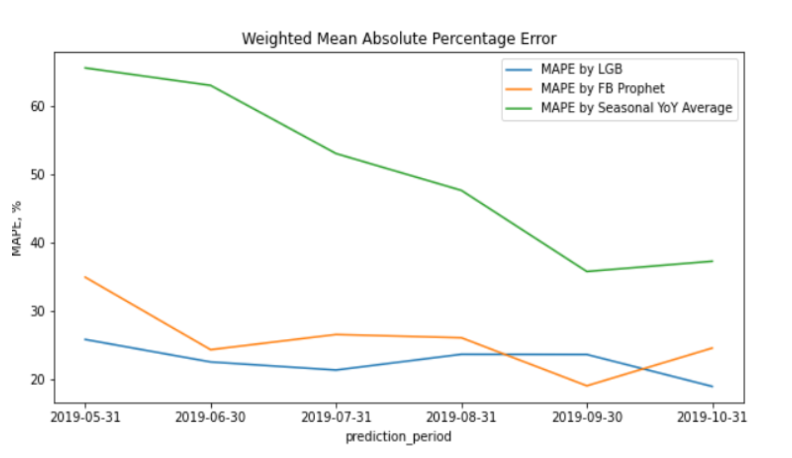

# Time series sales forecasting

This repository containts python script for time series forecasting of items sold.

# Python script usage

To make predictions, you need to put files with data to `data` folder. The script requires 3 files:
> sales.csv

> taxonomy.csv

> store.csv

The command to create predictions:

```
bash run_pipeline.sh
```

It needs to be run inside of the docker container.

# Jupyter notebooks

There are two notebooks
> /notebooks/EDA.ipynb - exploratory data analysis

> /src/ML Evaluation.ipynb - shows analytics for model performance

## Model performance

Model performace is based on Weighted MAPE metric
